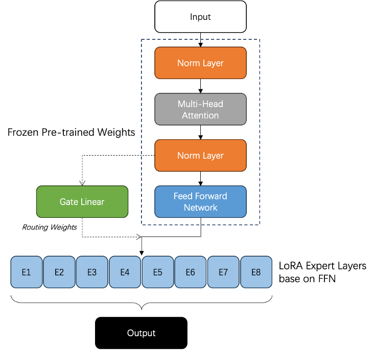

# MixLoRA: Resource-Efficient Model with Mix-of-Experts Architecture for Enhanced LoRA Performance

<div align="left"></div>

The fundamental concept of MixLoRA is based on a pre-trained model with all parameters frozen, such as LLaMA-7B. It involves training multiple LoRA expert modules on top of its fully connected layer (FFN). Simultaneously, a routing layer (Gate Linear) is trained, creating a more powerful Mixture of Experts (MoE) language model. Recent studies show that the expert weights are relatively similar in existing MoE models, such as Mixtral, enabling the MixLoRA approach to achieve performance similar to existing MoE models but with fewer resources.

Additionally, MixLoRA also permits simultaneous fine-tuning of the attention layer, contributing to improved fine-tuning outcomes. In experiments, the MixLoRA model composed of 8 experts with attention layer adapters exhibits a faster rate of loss reduction compared to the MixLoRA model composed of 9 experts without attention layer adapters.

MixLoRA exists within m-LoRA in a unique LoRA adapter form. Consequently, m-LoRA is capable of simultaneously loading, training, and fine-tuning multiple distinct MixLoRA and LoRA models. However, it's essential to note that these models must be based on the same pre-trained model.

## Configuration of MixLoRA

Compared with LoRA, MixLoRA have some additional configurations.
```json
{
  "name": "lora_0",
  "optim": "adamw",
  "lr": 1e-5,
  "batch_size": 16,
  "micro_batch_size": 2,
  "test_batch_size": 64,
  "num_epochs": 3,
  "r": 8,
  "lora_alpha": 16,
  "lora_dropout": 0.05,
  "target_modules": {
      "q_proj": true,
      "k_proj": false,
      "v_proj": true,
      "o_proj": false,
      "w1_proj": false,
      "w2_proj": false,
      "w3_proj": false
  },
  "data": "yahma/alpaca-cleaned",
  "prompt": "template/alpaca.json",
  "group_by_length": false,
  "expand_side": "right"
}
```
This is an example of LoRA training configuration. You can find instructions at [README.md](./README.md).

MixLoRA have two routing strategies: top-k routing (like *Mixtral*) and top-1 switch routing (like *Switch Transformers*), can be configured with `"routing_strategy": "mixtral"` or `"routing_strategy": "switch"`.

**Top-k Routing**
```
{
  ...
  "routing_strategy": "mixtral",
  "num_experts": 8,
  "act_fn": "silu",
  "top_k": 2,
  ...
}
```

**Top-1 Switch Routing**
```
{
  ...
  "routing_strategy": "switch",
  "num_experts": 8,
  "act_fn": "gelu_new",
  "expert_capacity": 32,
  "jitter_noise": 0.1,
  "ffn_dropout": 0.1,
  ...
}
```
You can add these items into training configurations to enable the MixLoRA architecture.
## Create MixLoRA model

Basic command for creating a baseline model on the [Alpaca Cleaned](https://github.com/gururise/AlpacaDataCleaned) dataset:
```bash
CUDA_VISIBLE_DEVICES=0 python mlora.py \
  --base_model yahma/llama-7b-hf \
  --config ./config/alpaca_mixlora.json \
  --load_8bit
```
Please note that once the MixLoRA model is created, the number of experts in the model cannot be changed.

## Fine-tuning MixLoRA model

The MixLoRA model can also undergo further fine-tuning.
Basic command for finetuning a model on the [Alpaca Cleaned](https://github.com/gururise/AlpacaDataCleaned) dataset:
```bash
CUDA_VISIBLE_DEVICES=0 python mlora.py \
  --base_model yahma/llama-7b-hf \
  --config ./config/alpaca_mixlora.json \
  --load_8bit \
  --load_adapter
```

## Evaluate MixLoRA model

Currently, MixLoRA supports evaluation only through the m-LoRA framework.
```bash
CUDA_VISIBLE_DEVICES=0 python mlora.py \
  --base_model yahma/llama-7b-hf \
  --config ./config/alpaca_mixlora.json \
  --load_8bit \
  --inference
```
This apporach allows inference multiple MixLoRA and LoRA adapters simultaneously. We also provide a WebUI and an example for inference.
```bash
# Run WebUI of Inference
CUDA_VISIBLE_DEVICES=0 python inference.py \
  --base_model yahma/llama-7b-hf \
  --lora_weights scu-kdde/alpaca-mixlora-7b \
  --template template/alpaca.json \
  --load_8bit

# Simply Generate
CUDA_VISIBLE_DEVICES=0 python generate.py \
  --base_model yahma/llama-7b-hf \
  --lora_weights scu-kdde/alpaca-mixlora-7b \
  --template template/alpaca.json \
  --load_8bit \
  --instruction "What is m-LoRA?"
```

## Citation
Please cite the repo if you use the code in this repo.
```bibtex
@misc{Mix-LoRA,
  author = {Dengchun, Li and Tingfeng, Lan and Zhengmao, Ye and Lei, Duan and Mingjie, Tang},
  title = {MixLoRA: Resource-Efficient Model with Mix-of-Experts Architecture for Enhanced LoRA Performance},
  year = {2023},
  publisher = {GitHub},
  howpublished = {\url{https://github.com/TUDB-Labs/multi-lora-fine-tune}},
}
```

## Copyright
Copyright © 2023 All Rights Reserved.

This project is licensed under the [Apache 2.0 License](https://www.apache.org/licenses/LICENSE-2.0).

```
Licensed under the Apache License, Version 2.0 (the "License");
you may not use this file except in compliance with the License.
You may obtain a copy of the License at

     http://www.apache.org/licenses/LICENSE-2.0

Unless required by applicable law or agreed to in writing, software
distributed under the License is distributed on an "AS IS" BASIS,
WITHOUT WARRANTIES OR CONDITIONS OF ANY KIND, either express or implied.
See the License for the specific language governing permissions and
limitations under the License.
```
