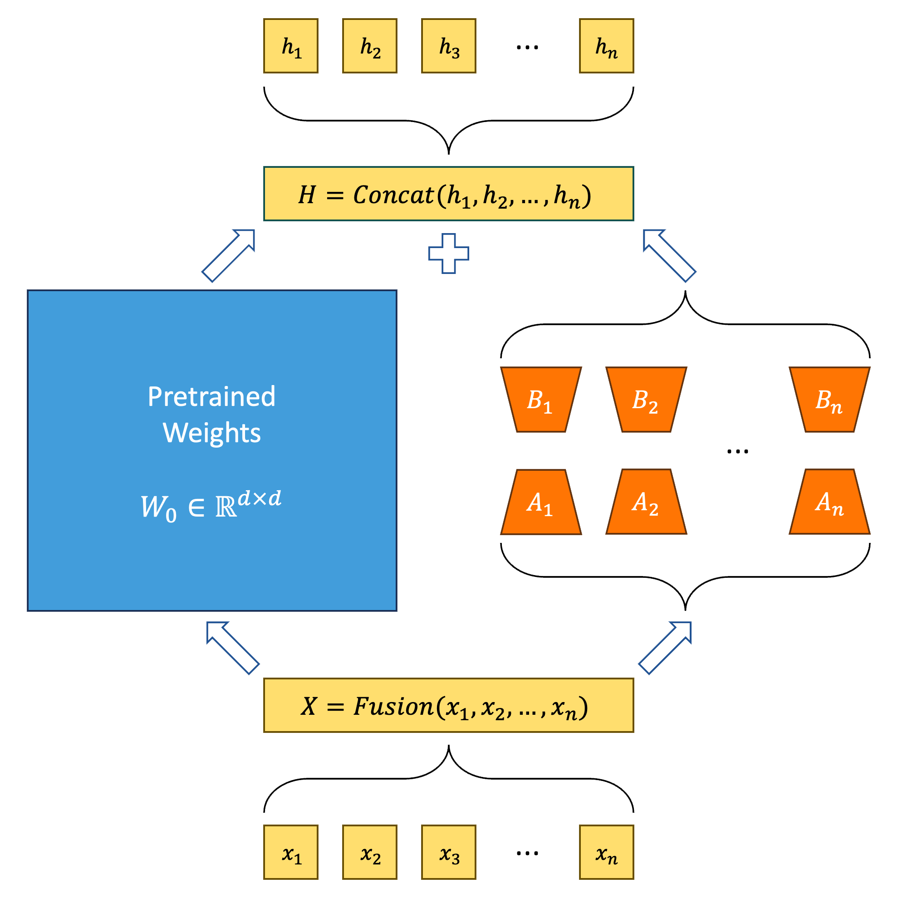
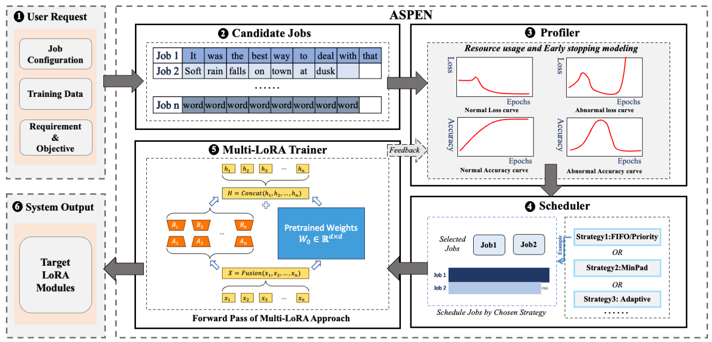
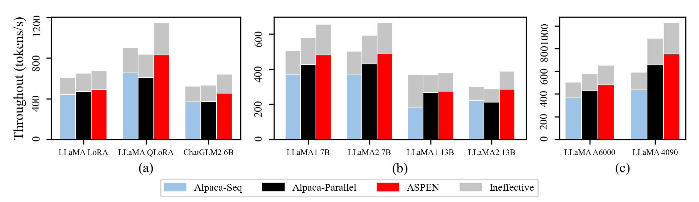
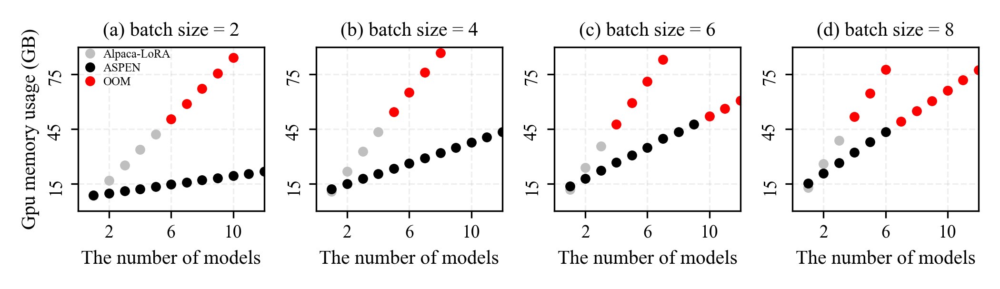

# m-LoRA: Efficient LLM Model Fine-Tune via Multi-LoRA Optimization
[](https://github.com/TUDB-Labs/multi-lora-fine-tune/actions/workflows/python-test-main.yml)
[](https://github.com/TUDB-Labs/multi-lora-fine-tune/stargazers)
[](http://www.apache.org/licenses/LICENSE-2.0)
[](https://github.com/TUDB-Labs/multi-lora-fine-tune/releases/latest)
[](https://www.python.org/)  

m-LoRA (a.k.a Multi-Lora Fine-Tune) is an open-source framework for fine-tuning Large Language Models (LLMs) using the efficient multiple LoRA/QLoRA methods. Key features of m-LoRA include:

- Efficient LoRA/QLoRA: Optimizes the fine-tuning process, significantly reducing GPU memory usage by leveraging a shared frozen-based model.

- Multiple LoRA Adapters: Support for concurrent fine-tuning of multiple LoRA/QLoRA adapters.

## Contents

- [Updates](#updates)
- [Supported Models](#Models)
- [Overview](#overview)
- [Getting Started](#Quickstart)
- [Installation](#Installation)
- [Contributing](#Contributing)
- [Copyright](#Copyright)

## Updates
- Support multiple Qwen2 fine-tuning
- Support multiple Mistral fine-tuning
- Support multiple LLaMA2 fine-tuning
- Support multiple ChatGLM fine-tuning
- Support multiple LLaMA fine-tuning
- On the way, Baichuan

## Models

|         | Model                                                    | # Parameters    |
|---------|----------------------------------------------------------|-----------------|
| &check; | [LLaMA](https://github.com/facebookresearch/llama)       | 7B/13B/33B/65B  |
| &check; | [LLaMA-2](https://huggingface.co/meta-llama)             | 7B/13B/70B      |
| &check; | [Qwen-2](https://qwenlm.github.io)                       | 4B/7B/14B/72B   |
| &check; | [Mistral](https://mistral.ai)                            | 7B              |
| &check; | [ChatGLM](https://github.com/THUDM/ChatGLM-6B)           | 6B              |
| &check; | [ChatGLM2](https://github.com/THUDM/ChatGLM2-6B)         | 6B/12B          |
| &cross; | [ChatGLM3](https://github.com/THUDM/ChatGLM3)            | 6B              |
| &cross; | [Baichuan](https://github.com/baichuan-inc/Baichuan-13B) | 7B/13B          |
| &cross; | [Baichuan2](https://github.com/baichuan-inc/Baichuan2)   | 7B/13B          |

> **Example:** Use our system  to improve the LLaMa-2 fine-tuning with less resources
>https://www.kaggle.com/code/rraydata/multi-lora-example/notebook

## Overview

**m-LoRA** is a high-throughput LLM fine-tuning framework based on LoRA and QLoRA, compatible with HuggingFace-Transformers LLaMA Models and ChatGLM Models.

This picture shows the basic principle of LoRA and Multi-LoRA.

<div align="center"></div>
The system overview of m-LoRA is as follows.
<div align="center"></div>

m-LoRA requires [PyTorch](https://pytorch.org/) and [NVIDIA CUDA](https://developer.nvidia.com/cuda-toolkit) compatible GPUs.

### Main Contribution

- Introduces the Multi-LoRA method, capable of enabling the sharing of pre-trained model weights during the fine-tuning process of large language models;
- Proposes a task scheduling algorithm to enhance the overall throughput of the task training process and reduce total training latency;
- Builds upon the above by implementing m-LoRA, a high-throughput large language model fine-tuning framework based on LoRA and QLoRA;
- Evaluates m-LoRA in experiments against existing systems, confirming that m-LoRA effectively utilizes system computing resources, thereby improving training throughput and reducing training latency compared to current systems.

### Experiment Results

Environment: NVIDIA RTX A6000 with Intel Xeon Silver 4314 on Ubuntu 22.04.3

Baseline: We utilized the widely adopted [Alpaca-LoRA](https://github.com/tloen/alpaca-lora) as a foundation. On a single GPU, we independently ran multiple Alpaca-LoRA processes in parallel (marked as *Baseline@Alpaca-Parallel*) and sequentially (marked as *Baseline@Alpaca-Seq*), forming two baseline methods for the experiments. We test this on A100, and rest of results are based on the same GPU configure.

#### Training Latency and Throughput

Method|Latency|Throughput
:---:|:---:|:---:
Baseline@Alpaca-Seq|10.51h|608.41 token/s
Baseline@Alpaca-Parallel|9.85h|649.30 token/s
m-LoRA|9.46h|674.58 token/s

We conducted four identical fine-tuning jobs with same dataset and same hyper-parameters, incorporating two baselines and m-LoRA. During the experimental process, we collected the completion times for each task in the baseline methods and calculated the time taken by the slowest task as the *Training Latency*. As shown in Table, m-LoRA exhibits lower *Training Latency* compared to both baseline methods. Specifically, m-LoRA is 9.99% faster than *Baseline@Alpaca-Seq* and 3.92% faster than *Baseline@Alpaca-Parallel*.
<div align="center"></div>


#### Video Memory Usage
<div align="center"></div>

We conducted several fine-tuning jobs with same dataset and `batch_size = {2,4, 6, 8}`, incorporating  *Baseline@Alpaca-Parallel* and m-LoRA. 

*Baseline@Alpaca-Parallel* triggered OOM error after 3 parallel tasks when batch size = 8, while m-LoRA can handle twice that amount.

#### Batching Strategies

Method|Training Latency|Peak Memory Usage|Average GPU Utilization|Training Throughput
:---:|:---:|:---:|:---:|:---:
Baseline@Alpaca-Seq|27.73h|10.68GB|79.39%|653.35 token/s
m-LoRA@M1|36.82h|23.82GB|96.52%|672.54 token/s
m-LoRA@M2|39.14h|23.86GB|96.41%|671.28 token/s
m-LoRA@M3|22.97h|23.85GB|95.22%|674.41 token/s

We conducted four fine-tuning jobs with different dataset but same hyper-parameters, incorporating  *Baseline@Alpaca-Seq* and m-LoRA. 

During the experimental process, we collected following metrics:
 + *Training Latency* = Job completion time
 + *Throughput* = The number of passed tokens in model forward process / training latency
 + *Memory Usage* = Peak video memory usage
 + *GPU Utilization* = Average GPU utilization

All metrics are computed for each job. `M1, M2, M3` represent three batch strategies of m-LoRA: *Optimal-Fit, Trivial, and Fast-Fit*. `BASELINE` denotes *Baseline@Alpaca-Seq*.

The *Optimal-Fit* strategy performs the best across all four metrics, while the other two strategies also outperform the baseline method other than training latency.
### Use Cases:
- Domain-Specific Fine-Tuning: This involves adapting a single model with various parameters particularly for one domain.
- Cross-Domain Fine-Tuning: This method leverages the base model to fine-tune multiple models, each intended for a different domain.

## Quickstart

Firstly, you should clone this repository and install dependencies:
```bash
# Clone Repository
git clone https://github.com/TUDB-Labs/multi-lora-fine-tune
cd multi-lora-fine-tune
# Install requirements
pip install -r requirements.txt
```

The `mlora.py` code is a starting point for finetuning on various datasets.
Basic command for finetuning a baseline model on the [Alpaca Cleaned](https://github.com/gururise/AlpacaDataCleaned) dataset:
```bash
python mlora.py \
  --base_model yahma/llama-7b-hf \
  --config ./config/alpaca.json \
  --load_8bit
```

You can check the template finetune configuration in [template](./template/) folder.

For further detailed usage information, please use `--help` option:
```bash
python mlora.py --help
```

## Running m-LoRA in Multi-GPUs(Experimental Feature)
m-LoRA employs a distinctive approach to pipeline parallelism for executing parallel tasks across multiple GPUs. Below are parameters designed to facilitate the use of Multi-GPUs.

- `--pipeline`: enables support for multi-GPU setups.
- `--rank`: specifies the worker's index in the pipeline (ranging from 0 to the number of GPUs minus 1).
- `--device`: specifies the device for loading weights.
- `--balance`: defines a sequence indicating the number of layers that should be loaded by the worker at a specific index.

Currently, only weights in the safetensors format are supported. If you have weights in the Hugging Face PyTorch format, you can use the following code to convert them:

```bash
python trans_to_safetensors.py --model_path /home/local_model
```

Suppose the model has 35 layers(32 transformer layer and 3 other layer). Here are basic commands for finetuning this model on 4 GPUs platform:

```bash
python mlora.py \
  --base_model /home/local_model \
  --config ./config/alpaca.json \
  --pipeline \
  --rank 0 \
  --device cuda:0 \
  --balance 9 9 9 8 &

python mlora.py \
  --base_model /home/local_model \
  --config ./config/alpaca.json \
  --pipeline \
  --rank 1 \
  --device cuda:1 \
  --balance 9 9 9 8 &

python mlora.py \
  --base_model /home/local_model \
  --config ./config/alpaca.json \
  --pipeline \
  --rank 2 \
  --device cuda:2 \
  --balance 9 9 9 8 &

python mlora.py \
  --base_model /home/local_model \
  --config ./config/alpaca.json \
  --pipeline \
  --rank 3 \
  --device cuda:3 \
  --balance 9 9 9 8 &
```

## Demo on Colab
You can run finetune on Colab by following this example: [Google Colab Example](https://colab.research.google.com/drive/13ABrrcOv5iG1TCdKGZvxy9QN6YwPpOoI?usp=sharing). Make sure to switch the runtime environment to GPU before running it.

## Webui for m-LoRA
You can run finetune through webui by following the instructions in the ‘webui/Instruction.md’.Make sure to switch the runtime environment to GPU before running it.

## Installation
You can also install m-LoRA into your environment:
```bash
# Optional but recommended
conda create -n mlora_env python=3.8
conda activate mlora_env
# Install requirements
pip install mlora
```
After installation, you can use m-LoRA directly in your code:
```python
import mlora
```
## Contributing
We welcome contributions to improve this repository! Please review the contribution guidelines before submitting pull requests or issues.

Fork the repository.
Create a new branch for your feature or fix.
Submit a pull request with a detailed explanation of your changes.

You can use the pre-commit to check your code.
```bash
ln -s ../../.github/workflows/pre-commit .git/hooks/pre-commit
```

## Citation
Please cite the repo if you use the code in this repo.
```bibtex
@misc{m-LoRA,
  author = {Zhengmao, Ye\textsuperscript{*} and Dengchun, Li\textsuperscript{*} and Jingqi, Tian and Tingfeng, Lan and Yanbo, Liang and Yexi, Jiang and Jie, Zuo and Hui, Lu and Lei, Duan and Mingjie, Tang},
  title = {m-LoRA: Efficient LLM Model Fine-tune and Inference via Multi-Lora Optimization},
  year = {2023},
  publisher = {GitHub},
  howpublished = {\url{https://github.com/TUDB-Labs/multi-lora-fine-tune}},
  note={\textsuperscript{*}: these authors contributed equally to this work.}
}
```

## Copyright
Copyright © 2023 All Rights Reserved.

This project is licensed under the [Apache 2.0 License](https://www.apache.org/licenses/LICENSE-2.0).

```
Licensed under the Apache License, Version 2.0 (the "License");
you may not use this file except in compliance with the License.
You may obtain a copy of the License at

     http://www.apache.org/licenses/LICENSE-2.0

Unless required by applicable law or agreed to in writing, software
distributed under the License is distributed on an "AS IS" BASIS,
WITHOUT WARRANTIES OR CONDITIONS OF ANY KIND, either express or implied.
See the License for the specific language governing permissions and
limitations under the License.
```
