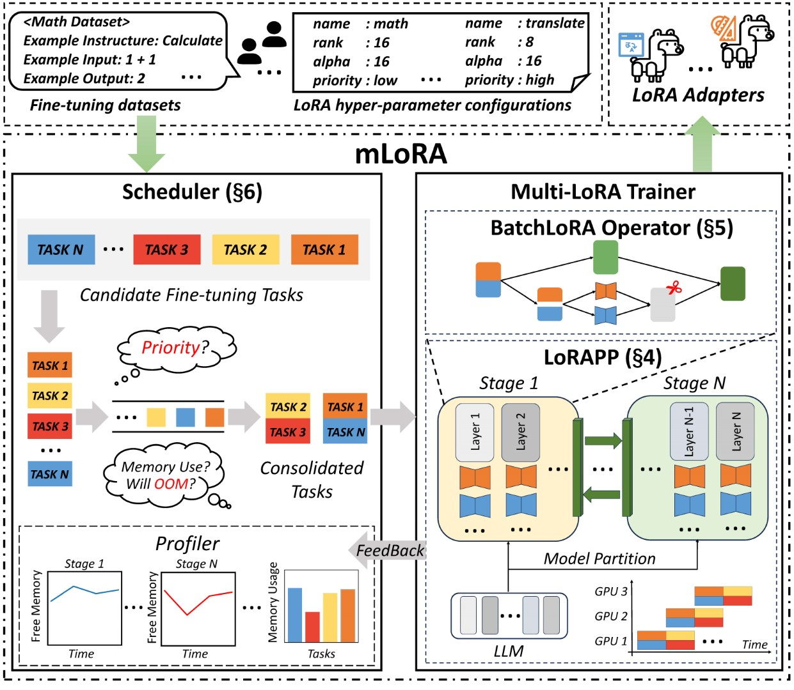

<h1 align="center"> <p>mLoRA</p></h1>
<h3 align="center">
  <p>An Efficient "Factory" to Build Multiple LoRA Adapters</p>
</h3>

[](https://github.com/TUDB-Labs/mLoRA/stargazers)
[](http://www.apache.org/licenses/LICENSE-2.0)
[](https://www.python.org/)
[](https://github.com/TUDB-Labs/mLoRA/releases/latest)
[](https://github.com/TUDB-Labs/mLoRA/actions/workflows/main-finetune-test.yaml)

<div align="center">

</div>


mLoRA (a.k.a Multi-LoRA Fine-Tune) is an open-source framework designed for efficient fine-tuning of multiple Large Language Models (LLMs) using LoRA and its variants. Key features of mLoRA include:

- Concurrent fine-tuning of multiple LoRA adapters.

- Shared base model among multiple LoRA adapters.

- Efficient pipeline parallelism algorithm.

- Support for multiple LoRA variant algorithms and various base models.

- Support for multiple reinforcement learning preference alignment algorithms.

The end-to-end architecture of the mLoRA is shown in the figure:

<div align="center">

</div>

## Latest News

* [2025/01] mLoRA has been accepted by VLDB'25

## Quickstart

Firstly, you should clone this repository and install dependencies (or use our image):
```bash
# Clone Repository
git clone https://github.com/TUDB-Labs/mLoRA
cd mLoRA
# Install requirements need the Python >= 3.12
pip install .
```

The `mlora_train.py` code is a starting point for batch fine-tuning LoRA adapters.
```bash
python mlora_train.py \
  --base_model TinyLlama/TinyLlama-1.1B-Chat-v0.4 \
  --config demo/lora/lora_case_1.yaml
```

You can check the adapters' configuration in [demo](./demo/) folder, there are some configuration regarding the use of different LoRA variants and reinforcement learning preference alignment algorithms.

For further detailed usage information, please use `--help` option:
```bash
python mlora_train.py --help
```

## Deployment using pipeline parallelism
Similar to Quickstart, the command to start in a two-node environment is as follows:

NOTE1: Use environment variables `MASTER_ADDR/MASTER_PORT` to set the master node.

NOTE2: Set balance, indicating the number of decoder layers allocated to each rank.


```bash
# in the first node
export MASTER_ADDR=master.svc.cluster.local
export MASTER_PORT=12355
python mlora_pp_train.py \
  --base_model TinyLlama/TinyLlama-1.1B-Chat-v0.4 \
  --config demo/lora/lora_case_1.yaml \
  --pipeline \
  --device "cuda:0" \
  --rank 0 \
  --balance 12 13 \
  --no-recompute \
  --precision fp32

# in the second node
export MASTER_ADDR=master.svc.cluster.local
export MASTER_PORT=12355
python mlora_pp_train.py \
  --base_model TinyLlama/TinyLlama-1.1B-Chat-v0.4 \
  --config demo/lora/lora_case_1.yaml \
  --pipeline \
  --device "cuda:1" \
  --rank 1 \
  --balance 12 13 \
  --no-recompute \
  --precision fp32
```


## Quickstart with Docker
mLoRA offers an official Docker image for quick start and development, The image is available on Dockerhub Packages registry.

First, you should pull the latest image (the image also use for development):
```bash
docker pull yezhengmaolove/mlora:latest
```
Deploy and enter a container to run mLoRA:
```bash
docker run -itd --runtime nvidia --gpus all \
    -v ~/your_dataset_dir:/dataset \
    -v ~/your_model_dir:/model \
    -p <host_port>:22 \
    --name mlora \
    yezhengmaolove/mlora:latest
# when the container started, use the ssh to login
# the default password is mlora@123
ssh root@localhost -p <host_port>
# pull the latest code and run the mlora
cd /mLoRA
git pull
python mlora_train.py \
  --base_model TinyLlama/TinyLlama-1.1B-Chat-v0.4 \
  --config demo/lora/lora_case_1.yaml
```

## Deploy as service with Docker
We can deploy mLoAR as a service to continuously receive user requests and perform fine-tuning task.

First, you should pull the latest image (use same image for deploy):

```bash
docker pull yezhengmaolove/mlora:latest
```

Deploy our mLoRA server:
```bash
docker run -itd --runtime nvidia --gpus all \
    -v ~/your_dataset_cache_dir:/cache \
    -v ~/your_model_dir:/model \
    -p <host_port>:8000 \
    --name mlora_server \
    -e "BASE_MODEL=TinyLlama/TinyLlama-1.1B-Chat-v0.4" \
    -e "STORAGE_DIR=/cache" \
    yezhengmaolove/mlora:latest /bin/bash /opt/deploy.sh
```

Once the service is deployed, install and use `mlora_cli.py` to interact with the server.

```bash
# install the client tools
pip install mlora-cli
# use the mlora cli tool to connect to mlora server
mlora_cli
(mLoRA) set port <host_port>
(mLoRA) set host http://<host_ip>
# and enjoy it!!
```

<details>

<summary>Step-by-step</summary>

### Step1. Download the mlora image and install the mlora_cli
```bash
docker pull yezhengmaolove/mlora:latest
pip install mlora-cli
```
[](https://asciinema.org/a/TfYrIsXgfZeMxPRrzOkWZ7T4b)

### Step2. Start the mlora server with Docker
```bash
# first, we create a cache dir in host for cache some file
mkdir ~/cache
# second, we manually download the model weights from Hugging Face.
mkdir ~/model && cd ~/model
git clone https://huggingface.co/TinyLlama/TinyLlama-1.1B-Chat-v1.0
# we map port 8000 used by the mlora server to port 1288 on the host machine.
# the BASE_MODEL environment variable indicates the path of the base model used by mlora.
# the STORAGE_DIR environment variable indicates the path where datasets and lora adapters are stored.
# we use the script /opt/deploy.sh in container to start the server.
docker run -itd --runtime nvidia --gpus all \
    -v ~/cache:/cache \
    -v ~/model:/model \
    -p 1288:8000 \
    --name mlora_server \
    -e "BASE_MODEL=/model/TinyLlama-1.1B-Chat-v1.0" \
    -e "STORAGE_DIR=/cache" \
    yezhengmaolove/mlora:latest /bin/bash /opt/deploy.sh
```
[](https://asciinema.org/a/LrLH0jU176NQNfawHpCITaLGx)

### Step3. use mlora_cli tool link to mlora server
we use mlora_cli link to the server http://127.0.0.1:1288 (must use the http protocal)
```bash
(mLoRA) set port 1288
(mLoRA) set host http://127.0.0.1
```
[](https://asciinema.org/a/GN1NBc2MEN8GrmcIasmIMDjNa)

### Step4. upload some data file for train.
we use the Stanford Alpaca dataset as a demo, the data just like below:
```json
[{"instruction": "", "input": "", "output": }, {...}]
```
```bash
(mLoRA) file upload
? file type: train data
? name: alpaca
? file path: /home/yezhengmao/alpaca-lora/alpaca_data.json
```
[](https://asciinema.org/a/KN41mnlMShZWDs3dIrd64L4nS)

### Step5. upload some template to provide a structured format for generating prompts
the template in a yaml file, and write by templating language Jinja2, see the demo/prompt.yaml file

the data file you upload can be considered as array data, with the elements in the array being of dictionary type. we consider each element as a data point in the template.
```bash
(mLoRA) file upload
? file type: prompt template
? name: simple_prompt
? file path: /home/yezhengmao/mLoRA/demo/prompt.yaml
```
[](https://asciinema.org/a/SFY8H0K4DppVvqmQCVuOuThoz)

### Step6. create a dataset
we create a dataset, the dataset consists of data, a template, and the corresponding prompter.
we can use `dataset showcase` command to check the if the prompts are generated correctly.
```bash
(mLoRA) dataset create
? name: alpaca_dataset
? train data file: alpaca
? prompt template file: simple_prompt
? prompter: instruction
? data preprocessing: default
(mLoRA) dataset showcase
? dataset name: alpaca_dataset
```
[](https://asciinema.org/a/mxpwo6gWihjEEsJ0dfcXG98cM)

### Step7. create a adapter
now we can use `adapter create` command to create a adapter for train.

[](https://asciinema.org/a/Wf4PHfoGC0PCcciGHOXCkX0xj)

### Step8. !!!! submit task to train !!!!
Finally, we can submit the task to train our adapter using the defined dataset.
NOTE: you can continuously submit or terminal training tasks.
use the `adapter ls` or `task ls` to check the tasks' status

[](https://asciinema.org/a/vr8f1XtA0CBULGIP81w2bakkE)


</details>


## Why you should use mLoRA

Using mLoRA can save significant computational and memory resources when training multiple adapters simultaneously.

### High performance on consumer hardware
We fine-tuned multiple LoRA adapters using four A6000 graphics cards with fp32 precision and without using checkpointing and any quantization techniques: 

| Model                                                               | mLoRA (tokens/s) | PEFT-LoRA with FSDP (tokens/s) | PEFT-LoRA with TP (tokens/s) |
| ------------------------------------------------------------------- | ---------------- | ------------------------------ | ---------------------------- |
| [llama-2-7b (32fp)](https://huggingface.co/meta-llama/llama-2-7b)   | 2364             | 1750                           | 1500                         |
| [llama-2-13b (32fp)](https://huggingface.co/meta-llama/llama-2-13b) | 1280             | OOM                            | 875                          |


### Supported model

|         | Model                            |
| ------- | -------------------------------- |
| &check; | [LLaMA](https://llama.meta.com/) |

### Supported LoRA variants

|         | Variant                                             |
| ------- | --------------------------------------------------- |
| &check; | [QLoRA](https://arxiv.org/abs/2305.14314),NIPS,2023 |
| &check; | [LoRA+](https://arxiv.org/abs/2402.12354),ICML,2024 |
| &check; | [VeRA](https://arxiv.org/abs/2310.11454),ICLR,2024  |
| &check; | [DoRA](https://arxiv.org/abs/2402.09353),ICML,2024  |

### Supported preference alignment algorithms
|         | Variant                                              |
| ------- | ---------------------------------------------------- |
| &check; | [DPO](https://arxiv.org/abs/2305.18290),NeurIPS,2024 |
| &check; | [CPO](https://arxiv.org/abs/2401.08417),ICML,2024    |
| &check; | [CIT](https://arxiv.org/abs/2402.11138),arXiv,2024   |


## Document

- Help Document[TODO]
- [Design Document](./docs/design.md)
- [How to develop a new adapter](./docs/develop_new_adapter.md)

## Contributing
We welcome contributions to improve this repository! Please review the contribution guidelines before submitting pull requests or issues.

Fork the repository.
Create a new branch for your feature or fix.
Submit a pull request with a detailed explanation of your changes.

You can use the pre-commit to check your code.
```bash
# Install requirements
pip install .[ci_test]
ln -s ../../.github/workflows/pre-commit .git/hooks/pre-commit
```
Or just call the script to check your code
```bash
.github/workflows/pre-commit
```

## Citation
Please cite the repo if you use the code in this repo.
```bibtex
@misc{ye2024mlorafinetuningloraadapters,
      title={mLoRA: Fine-Tuning LoRA Adapters via Highly-Efficient Pipeline Parallelism in Multiple GPUs}, 
      author={Zhengmao Ye and Dengchun Li and Zetao Hu and Tingfeng Lan and Jian Sha and Sicong Zhang and Lei Duan and Jie Zuo and Hui Lu and Yuanchun Zhou and Mingjie Tang},
      year={2024},
      eprint={2312.02515},
      archivePrefix={arXiv},
      primaryClass={cs.LG},
      url={https://arxiv.org/abs/2312.02515}, 
}
```

## Copyright
Copyright © 2024 All Rights Reserved.

This project is licensed under the [Apache 2.0 License](https://www.apache.org/licenses/LICENSE-2.0).

```
Licensed under the Apache License, Version 2.0 (the "License");
you may not use this file except in compliance with the License.
You may obtain a copy of the License at

     http://www.apache.org/licenses/LICENSE-2.0

Unless required by applicable law or agreed to in writing, software
distributed under the License is distributed on an "AS IS" BASIS,
WITHOUT WARRANTIES OR CONDITIONS OF ANY KIND, either express or implied.
See the License for the specific language governing permissions and
limitations under the License.
```
