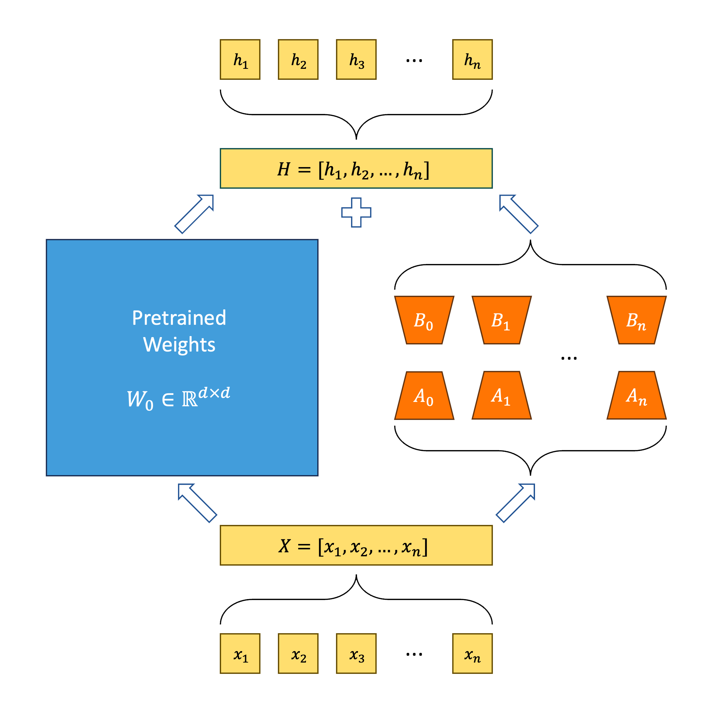

# ASPEN: Efficient LLM Model Fine-tune and Inference via Multi-Lora Optimization
[](https://github.com/TUDB-Labs/multi-lora-fine-tune/actions/workflows/python-test-main.yml)
[](https://github.com/TUDB-Labs/multi-lora-fine-tune/stargazers)
[](http://www.apache.org/licenses/LICENSE-2.0)
[](https://github.com/TUDB-Labs/multi-lora-fine-tune/releases/latest)
[](https://www.python.org/)  

This repository provides tools for fine-tuning large language models (LLMs) using the LoRA or QLoRA methods more efficiently. It provides the framework to support multiple LoRA/qLoRA models fine tunning at the same time. By reusing the shared frozen-based model, we provide the framework to reduce GPU Memory usage for multiple fine-tuning models.  

## Updates
- Beta version: Support multiple LLaMA fine-tuning via LORA in one GPU 

## Overview

<center></center>

**ASPEN** is written in Python3 and compatible with HuggingFace-Transformers LLaMA Models.

This picture shows the basic principle of Multi-LoRA.

### Disadvantages of LoRA-based Approaches:
- Memory Consumption: Some Lora techniques might be efficient, but the introduction of low-rank approximations can sometimes heighten memory usage, particularly if one has to store both original and approximated parameters.

- Potential for Reduced Model Accuracy: Lora-based fine-tuning is designed to either maintain or boost model accuracy. However, there can be instances where the approximations cause a dip in performance, especially if the low-rank approximations aren't chosen carefully.

- Dependence on Hyperparameters: Much like other ML techniques, Lora-based strategies involve hyperparameters that need precise fine-tuning. Mistakes in this area can lead to subpar performance.

### Improvements in LoRA-based Approaches:
- GPU Memory Conservation: Leveraging the base model more can help in significant GPU memory conservation, an essential aspect for efficient operations.
- Automatic Parameter Learning: Introducing automation in the learning process for hyperparameters during model fine-tuning can speed up the process and guarantee optimal model results.
- Early Stopping Mechanism: Implementing this approach ensures no overfitting occurs, and resources are utilized effectively. It stops training once the model's improvement becomes negligible.

### Use Cases:
- Domain-Specific Fine-Tuning: This involves adapting a single model with various parameters particularly for one domain.
- Cross-Domain Fine-Tuning: This method leverages the base model to fine-tune multiple models, each intended for a different domain.

## Quickstart

Firstly, you should clone this repository and install dependencies:
```bash
# Clone Repository
git clone https://github.com/TUDB-Labs/multi-lora-fine-tune
cd multi-lora-fine-tune
git submodule update --init
# Install requirements
pip install -r requirements.txt
```

The `mlora.py` code is a starting point for finetuning on various datasets.
Basic command for finetuning a baseline model on the Alpaca dataset:
```bash
python mlora.py \
  --base_model decapoda-research/llama-7b-hf \
  --config ./config/alpaca.json \
  --load_8bit true
```

You can check the template finetune configuration in [template](./template/) folder.

For further detailed usage information, please use `--help` option:
```bash
python mlora.py --help
```
## Installation
You can also install ASPEN into your environment:
```bash
# Optional but recommended
conda create -n aspen_env python=3.8
conda activate aspen_env
# Install requirements
pip install -r requirements.txt
```
After installation, you can use ASPEN directly in your code:
```python
import aspen
```
## Contributing
We welcome contributions to improve this repository! Please review the contribution guidelines before submitting pull requests or issues.

Fork the repository.
Create a new branch for your feature or fix.
Submit a pull request with a detailed explanation of your changes.

## Citation

```bibtex
@software{Ye_Multi-LoRA_2023,
  author = {Zhengmao Ye, Dengchun Li, Tingfeng Lan, Yanbo Liang, Yexi Jiang, Jie Zuo, Hui Lu, Lei Duan, Mingjie Tang},
  month = oct,
  title = {{Multi-LoRA}},
  url = {https://github.com/TUDB-Labs/multi-lora-fine-tune},
  version = {0.1},
  year = {2023}
}
```

## Copyright
Copyright © 2023 All Rights Reserved.

This project is licensed under the [Apache 2.0 License](https://www.apache.org/licenses/LICENSE-2.0).

```
Licensed under the Apache License, Version 2.0 (the "License");
you may not use this file except in compliance with the License.
You may obtain a copy of the License at

     http://www.apache.org/licenses/LICENSE-2.0

Unless required by applicable law or agreed to in writing, software
distributed under the License is distributed on an "AS IS" BASIS,
WITHOUT WARRANTIES OR CONDITIONS OF ANY KIND, either express or implied.
See the License for the specific language governing permissions and
limitations under the License.
```
