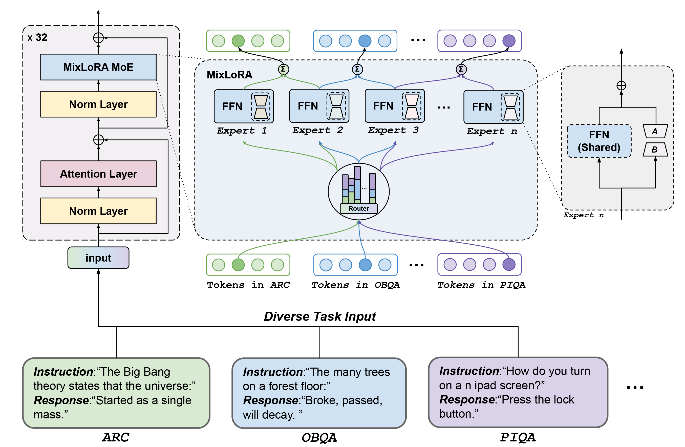

# MixLoRA: Resource-Efficient Model with Mix-of-Experts Architecture for Enhanced LoRA Performance

<div align="left"></div>

Large Language Models (LLMs) have showcased exceptional performance across a wide array of Natural Language Processing (NLP) tasks. Fine-tuning techniques are commonly utilized to tailor pre-trained models to specific applications. While methods like LoRA have effectively tackled GPU memory constraints during fine-tuning, their applicability is often restricted. On the other hand, Mix-of-Expert (MoE) models, such as Mixtral 8x7B, demonstrate remarkable performance while maintaining a reduced parameter count. However, the resource requirements of these models pose challenges, particularly for consumer-grade GPUs.

To address this challenge, we propose MixLoRA, an innovative approach aimed at constructing a resource-efficient sparse MoE model. MixLoRA inserts multiple LoRA-based experts within the feed-forward network block of a frozen pre-trained dense model through fine-tuning, employing a top-k routing strategy. Unlike other LoRA MoE methods, MixLoRA enhances model performance by utilizing independently configurable attention layer LoRA adapters, supporting LoRA and its variants for the construction of experts, and applying auxiliary load balance loss to address the imbalance problem of the router.

In experiments, MixLoRA achieves commendable performance across all evaluation metrics in both single-task and multi-task learning scenarios. Implemented within the m-LoRA framework, MixLoRA enables parallel fine-tuning, inference, and evaluation of multiple mixture-of-experts models on a single 24GB consumer-grade GPU without quantization, thereby reducing GPU memory consumption by 41% and latency during the training process by 17%.

| PEFT Method | # Params (%) | ARC-e | ARC-c | BoolQ | OBQA | PIQA | AVG. |
|-------------|--------------|-------|-------|-------|------|------|------|
| LoRA        | 2.6%         | 73.8  | 50.9  | 62.2  | 80.4 | 69.9 | 67.4 |
| DoRA        | 2.6%         | 76.5  | 59.8  | 71.7  | 80.6 | 78.8 | 73.5 |
| **MixLoRA** | 2.6%         | 76.5  | 58.1  | 73.8  | 84.4 | 82.6 | 75.1 |
| **MixDoRA** | 2.6%         | 78.3  | 59.6  | 74.2  | 84.4 | 83.6 | 76.0 |

The table above presents the performance of MixLoRA and compares these results with outcomes obtained by employing LoRA and DoRA for fine-tuning. The results demonstrate that the language model with MixLoRA achieves commendable performance across all evaluation methods. All methods are fine-tuned and evaluated with [meta-llama/Llama-2-7b-hf](https://huggingface.co/meta-llama/Llama-2-7b-hf) on m-LoRA, with all metrics reported as accuracy.

You can download the weights of MixLoRA fine-tuned with [meta-llama/Llama-2-7b-hf](https://huggingface.co/meta-llama/Llama-2-7b-hf) and [AlpacaCleaned](https://github.com/gururise/AlpacaDataCleaned) dataset on Hugging Face: [scukdde-llm/alpaca-mixlora-7b](https://huggingface.co/scukdde-llm/alpaca-mixlora-7b). Currently, only m-LoRA supports the inference of MixLoRA.

## Configuration of MixLoRA

Compared with LoRA, MixLoRA have some additional configurations.
```json
{
  "name": "lora_0",
  "optim": "adamw",
  "lr": 1e-5,
  "batch_size": 16,
  "micro_batch_size": 2,
  "test_batch_size": 64,
  "num_epochs": 3,
  "r": 8,
  "lora_alpha": 16,
  "lora_dropout": 0.05,
  "target_modules": {
      "q_proj": true,
      "k_proj": false,
      "v_proj": true,
      "o_proj": false,
      "w1_proj": false,
      "w2_proj": false,
      "w3_proj": false
  },
  "data": "yahma/alpaca-cleaned",
  "prompt": "template/alpaca.json",
  "group_by_length": false,
  "expand_side": "right"
}
```
This is an example of LoRA training configuration. You can find instructions at [README.md](./README.md).

MixLoRA have two routing strategies: top-k routing (like *Mixtral*) and top-1 switch routing (like *Switch Transformers*), can be configured with `"routing_strategy": "mixtral"` or `"routing_strategy": "switch"`.

**Top-k Routing**
```json
{
  ...
  "routing_strategy": "mixtral",
  "router_init_range": 0.02,
  "num_experts": 8,
  "act_fn": "silu",
  "top_k": 2,
  "router_aux_loss_coef": 0.01,
  ...
}
```

**Top-1 Switch Routing**
```json
{
  ...
  "routing_strategy": "switch",
  "router_init_range": 0.02,
  "num_experts": 8,
  "act_fn": "gelu_new",
  "expert_capacity": 32,
  "jitter_noise": 0.1,
  "ffn_dropout": 0.1,
  "router_aux_loss_coef": 0.01,
  "router_z_loss_coef": 0.01,
  ...
}
```
You can add these items into training configurations to enable the MixLoRA architecture.

If you want to control the lora settings of experts separately, just add `"expert_lora"` block to the config:
```json
{
  ...
  "expert_lora": {
    "r": 8,
    "lora_alpha": 16,
    "lora_dropout": 0.05
  },
  ...
}
```
## Create MixLoRA model

Basic command for creating a baseline model on the [Alpaca Cleaned](https://github.com/gururise/AlpacaDataCleaned) dataset:
```bash
python launch.py gen --template mixlora --tasks yahma/alpaca-cleaned
python launch.py run --base_model meta-llama/Llama-2-7b-hf
```
Please note that once the MixLoRA model is created, the number of experts in the model cannot be changed.

## Evaluate MixLoRA model

```bash
# Run WebUI of Inference
python inference.py \
  --base_model meta-llama/Llama-2-7b-hf \
  --lora_weights scukdde-llm/alpaca-mixlora-7b \
  --template template/alpaca.json

# Simply Generate
python generate.py \
  --base_model meta-llama/Llama-2-7b-hf \
  --lora_weights scukdde-llm/alpaca-mixlora-7b \
  --template template/alpaca.json \
  --instruction "What is m-LoRA?"
```

## Citation
If MixLoRA has been useful for your work, please consider citing it using the appropriate citation format for your publication.
```bibtex
@misc{MixLoRA,
  author = {Dengchun, Li and Yingzi, Ma and Naizheng, Wang and Zhiyuan, Cheng and Lei, Duan and Jie, Zuo and Mingjie, Tang},
  title = {MixLoRA: Enhancing Large Language Models Fine-Tuning with LoRA based Mixture of Experts},
  year = {2024},
  publisher = {GitHub},
  howpublished = {\url{https://github.com/scukdde-llm/mlora}},
}

@misc{alpaca-mixlora-7b,
  author = {Dengchun, Li and Yingzi, Ma and Naizheng, Wang and Zhiyuan, Cheng and Lei, Duan and Jie, Zuo and Mingjie, Tang},
  title = {MixLoRA LoRA MoE adapter based on AlpacaCleaned dataset and LLaMA-2-7B base model},
  year = {2024},
  publisher = {HuggingFace Hub},
  howpublished = {\url{https://huggingface.co/scukdde-llm/alpaca-mixlora-7b}},
}
```

## Copyright
Copyright © 2023-2024 All Rights Reserved.

m-LoRA and the weights of alpaca-mixlora-7b are licensed under the [Apache 2.0 License](https://www.apache.org/licenses/LICENSE-2.0).

```
Licensed under the Apache License, Version 2.0 (the "License");
you may not use this file except in compliance with the License.
You may obtain a copy of the License at

     http://www.apache.org/licenses/LICENSE-2.0

Unless required by applicable law or agreed to in writing, software
distributed under the License is distributed on an "AS IS" BASIS,
WITHOUT WARRANTIES OR CONDITIONS OF ANY KIND, either express or implied.
See the License for the specific language governing permissions and
limitations under the License.
```
