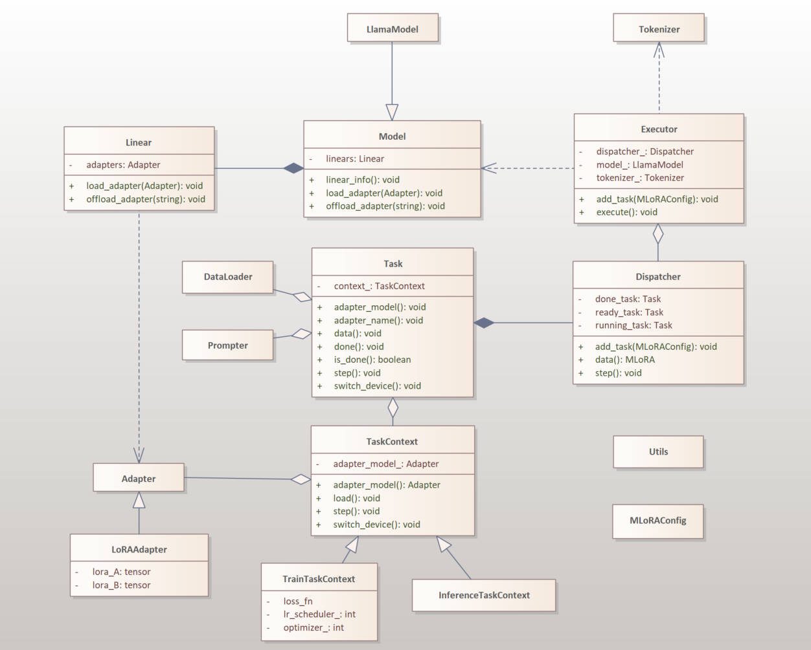

# The system's design

mLoRA includes the following main modules:

* model: the base model.

* tokenizer: the tokenizer used by task to generate the tokens.

* trainer: coordinating the base model and dispatcher, receiving user requests to generate relevant tasks.

* task: includes weights for training adapters, optimizers, datasets, etc.

## Workflow

step1. the dispatcher chose the task to run.

step2. inject the adapters' weight to the base model.

step3. get the train data from the tasks.

step4. update the adapters' weight and offload those weight in the base model.