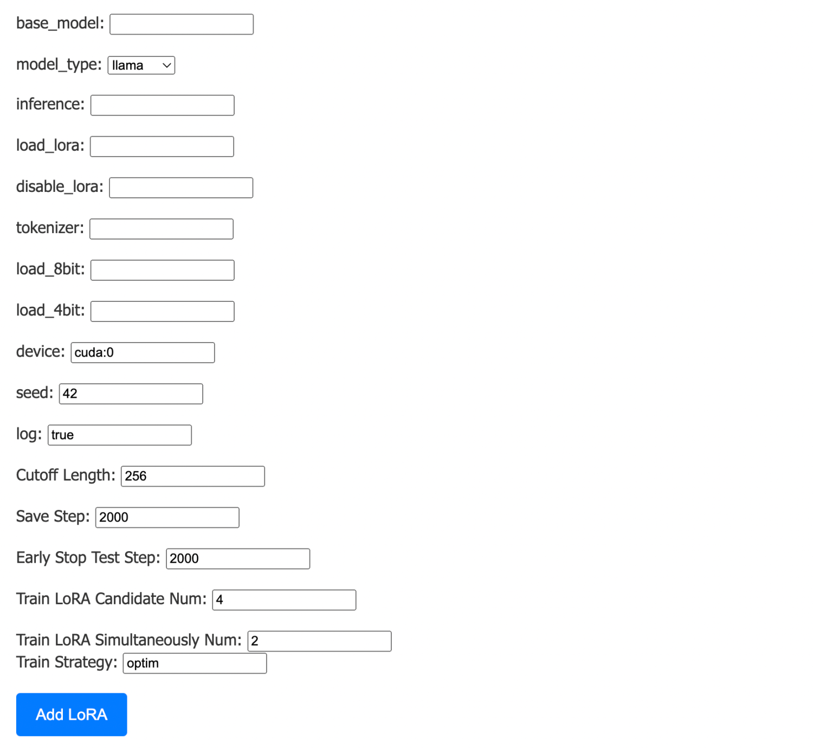
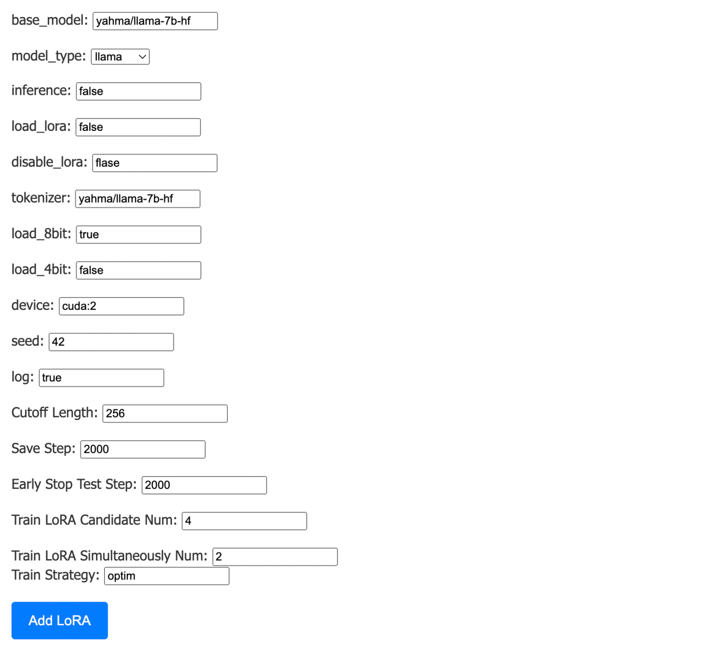
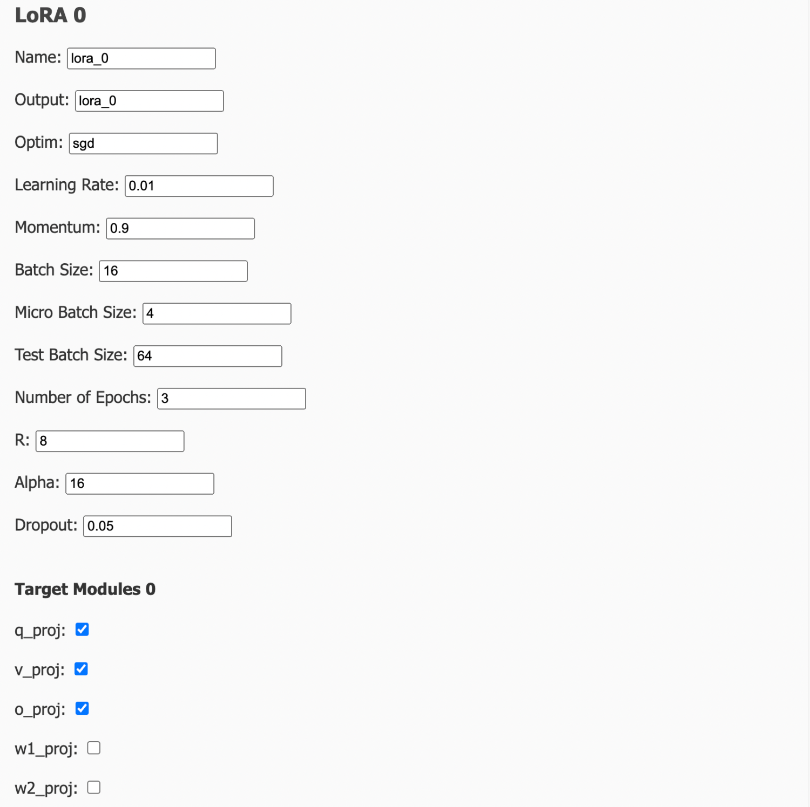
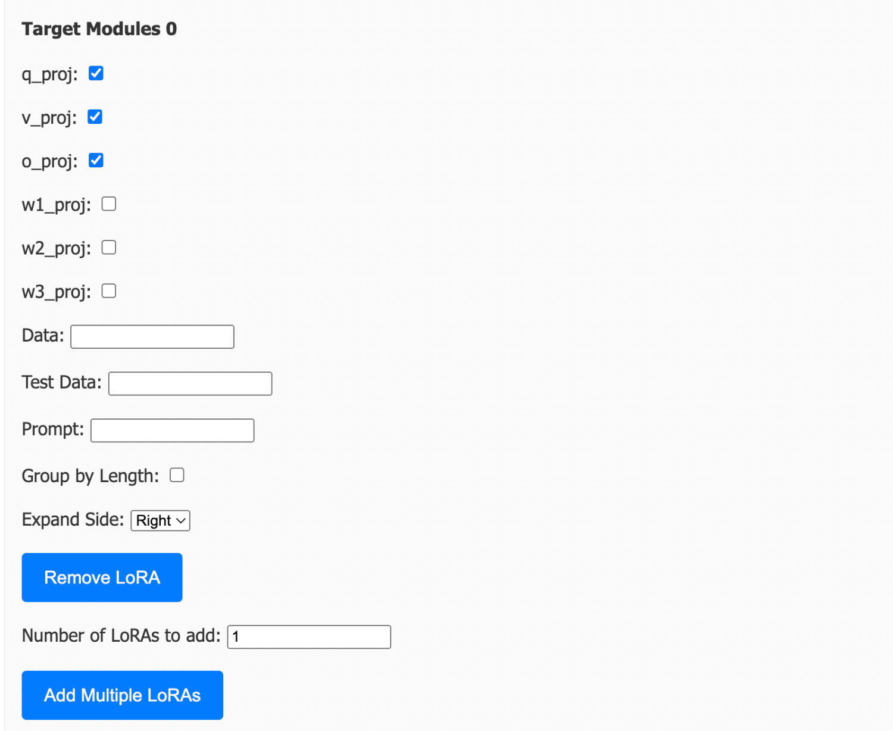
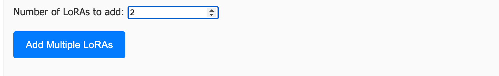
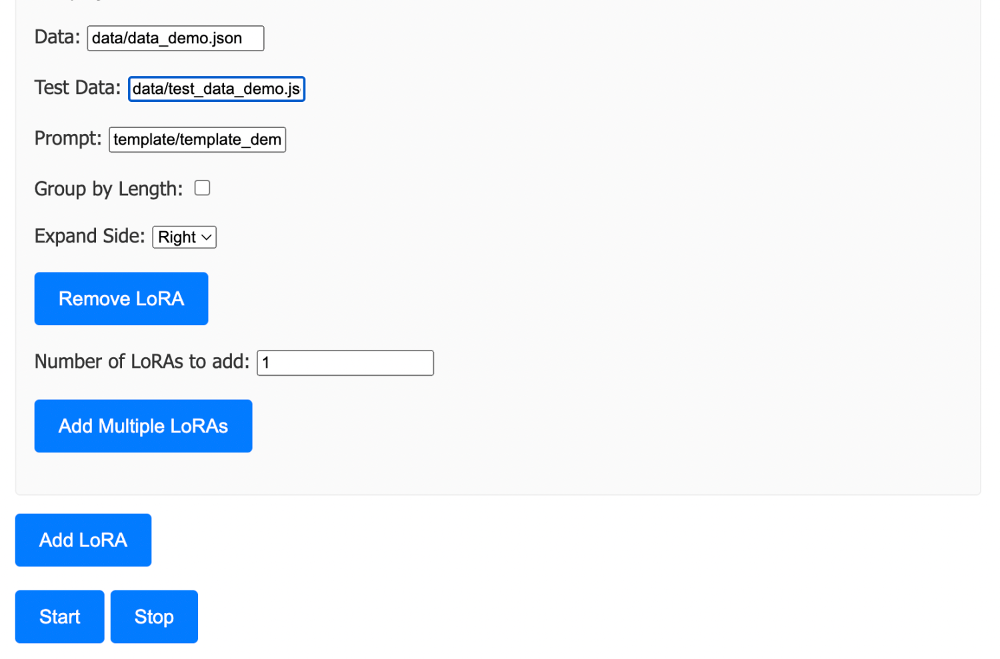
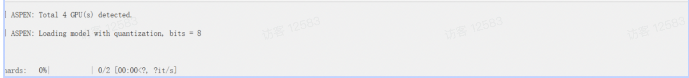

# m-LoRA webui Instruction
## 1. Clone multi-lora-fine-tune repository and open

```
git clone https://github.com/TUDB-Labs/multi-lora-fine-tune.git
```
## 2.Open multi-lora-fine-tune repository
```
cd multi-lora-fine-tune
```

## 3. Install denpendencies

```
pip install -r requirements.txt
```

## 4.Run app.py
```
cd webui
python app.py
```
## 5.Open the webui page

## 6.Config basic models and parameters
(Llama model as an example below, other models such as ChatGLM can also be selected)


## 7.Click 'Add LoRA' and fill in the LoRA parameters 



**If you need to copy the same LoRA, you can fill in  'Number of LoRAs to add', and click 'Add Multiple LoRAs', the same LoRA will be copied.**



## 8.Confirm and Click Start


**After start,view the log below.**



**P.S.You can click 'Stop' to terminate the training task.**