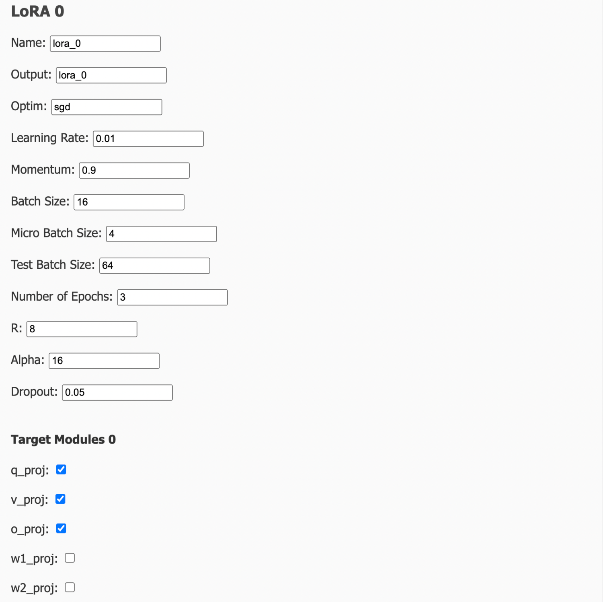

# m-LoRA GUI Instruction
## 1. Clone multi-lora-fine-tune repository and open

```
git clone https://github.com/TUDB-Labs/multi-lora-fine-tune.git
```

## 2. Install denpendencies

```
pip install -r multi-lora-fine-tune/requirements.txt
```

## 3.Open multi-lora-fine-tune repository

**(For example, opened in pycharm as follows.)**


## 4.Run app.py

## 5.Click the link to open the page


## 6.Config basic models and parameters
(Llama model as an example below, other models such as ChatGLM can also be selected)


## 7.Click 'Add LoRA' and fill in the LoRA parameters 



**If you need to copy the same LoRA, you can fill in  'Number of LoRAs to add', and click 'Add Multiple LoRAs', the same LoRA will be copied.**


## 8.Confirm and Click Start


**After start,view the log below.**


**P.S.You can click 'Stop' to terminate the training task.**